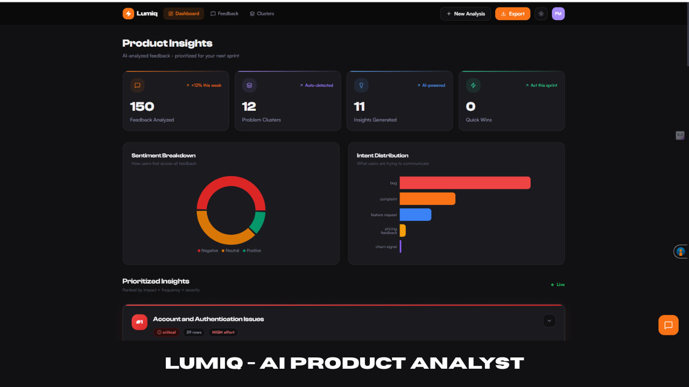
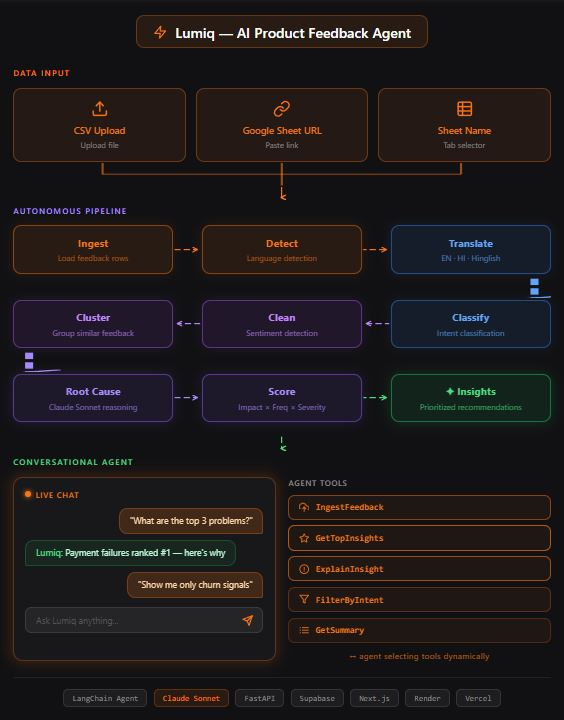

# Lumiq - AI Product Feedback Agent

> Turn messy user feedback into clear, prioritized, 
> and actionable product insights — automatically.



---

## 🔗 Quick Links

| | |
|---|---|
| **Live Product** | [Link](https://lumiq-ai-product-analyst.vercel.app) |
| **Video Walkthrough** | Add your video walkthrough link here |

---

## 📌 What is Lumiq?

Lumiq is an AI-powered product feedback agent built for product managers who are drowning in unstructured user feedback.

Most teams collect feedback from reviews, support tickets, surveys, and user calls — but struggle to convert that raw, noisy data into decisions they can act on.

Lumiq solves this by running an autonomous 9-step pipeline that ingests feedback, cleans it, clusters it, identifies root causes, scores each problem by impact and frequency, and generates sprint-ready recommendations - all without 
any manual effort.

Once the analysis is complete, a conversational AI agent lets you ask questions about the insights in plain English.

---

## 🎯 The Problem It Solves

Product managers spend hours manually reading feedback rows trying to find patterns. The process is slow, subjective, and prone to recency bias. Important signals get missed. Decisions get made on incomplete information.

Lumiq compresses hours of manual analysis into minutes and makes the output explainable, evidence-backed, and prioritized.

---

## ✨ Key Features

- **Multi-source ingestion** — Upload a CSV, paste a Google Sheet URL, or connect via sheet name
- **Multilingual support** — Handles English, Hindi, and Hinglish feedback automatically
- **Intent classification** — Tags each row as bug, complaint, feature request, churn signal, pricing feedback, praise, or question
- **AI clustering** — Groups similar feedback into meaningful problem themes using TF-IDF embeddings and K-Means clustering
- **Root cause analysis** — Claude Sonnet identifies WHY each problem exists, not just WHAT users are saying
- **Priority scoring** — Weighs each insight by impact, frequency, severity, and confidence
- **Actionable recommendations** — Generates sprint-ready actions with success metrics and effort estimates
- **Conversational agent** — Ask questions about your insights in plain English via built-in chat
- **Export** — Download all insights as CSV for stakeholder sharing
- **Dark and light mode** — Clean, responsive UI that works on desktop and mobile

---

## 🏗️ System Architecture



### Pipeline Overview  

User Input (CSV / Google Sheet URL / Sheet Name)  
↓  
[1] Ingestion — Load feedback rows into Supabase  
↓  
[2] Language Detection — Detect en / hi / hinglish  
↓  
[3] Translation — Translate to English via deep-translator  
↓  
[4] Intent Classification — Claude Haiku (batched)  
↓  
[5] Cleaning — Rule-based + VADER sentiment detection  
↓  
[6] Clustering — TF-IDF + SVD + K-Means (auto cluster count)  
↓  
[7] Root Cause Analysis — Claude Sonnet (per cluster)  
↓  
[8] Scoring — Weighted formula (impact × frequency × severity)  
↓  
[9] Insight Generation — Claude Sonnet (recommendations)  
↓  
Dashboard + Conversational Agent  

---

## 🛠️ Tech Stack

### Backend
| Layer | Technology |
|---|---|
| Language | Python 3.12 |
| API Framework | FastAPI |
| Agent Orchestration | LangChain |
| AI Models | Claude Haiku (classification), Claude Sonnet (reasoning) |
| Embeddings | TF-IDF + SVD (scikit-learn) |
| Sentiment Analysis | VADER |
| Language Detection | langdetect |
| Translation | deep-translator |
| Database ORM | SQLAlchemy |

### Frontend
| Layer | Technology |
|---|---|
| Framework | Next.js 16 |
| Styling | Tailwind CSS |
| Charts | Recharts |
| Markdown | react-markdown + remark-gfm |
| Fonts | Clash Display + Satoshi |

### Infrastructure
| Service | Purpose |
|---|---|
| Supabase | PostgreSQL database |
| Render | FastAPI backend hosting |
| Vercel | Next.js frontend hosting |
| GitHub | Version control |

---

## 📁 Project Structure  
lumiq/  
├── agent/                    # LangChain agent + tools  
│   ├── lumiq_agent.py        # Agent definition + memory  
│   └── tools.py              # 5 agent tools  
├── backend/                  # FastAPI application  
│   ├── main.py               # API routes  
│   ├── pipeline.py           # Pipeline orchestrator  
│   └── state.py              # Pipeline state management  
├── cleaning/                 # Text cleaning module  
│   └── cleaner.py  
├── clustering/               # Feedback clustering  
│   └── clusterer.py  
├── config/                   # Configuration  
│   └── settings.py  
├── db/                       # Database layer  
│   ├── init_db.py  
│   └── schema.py   
├── ingestion/                # Data ingestion  
│   └── ingest.py  
├── output/                   # Insight generation  
│   └── reporter.py  
├── preprocessing/            # Language + intent pipeline  
│   ├── detector.py  
│   ├── intent_classifier.py  
│   ├── preprocessor.py  
│   └── translator.py  
├── reasoning/                # Root cause analysis  
│   └── analyzer.py  
├── scoring/                  # Priority scoring  
│   └── prioritizer.py  
└── frontend/                 # Next.js dashboard  
├── app/  
│   ├── page.tsx           # Dashboard  
│   ├── analyse/           # New analysis page  
│   ├── feedback/          # Feedback explorer  
│   └── clusters/          # Cluster breakdown  
└── components/  
├── AgentChat.tsx      # Conversational agent UI  
├── InsightCard.tsx    # Priority insight cards  
├── Navbar.tsx         # Navigation  
├── SentimentChart.tsx # Donut chart  
└── IntentChart.tsx    # Bar chart  

---

## 🚀 Getting Started

### Prerequisites

- Python 3.12+
- Node.js 18+
- Supabase account (free tier)
- Anthropic API key

### 1. Clone the repository

```bash
git clone https://github.com/shijin/Lumiq-AIProductAnalyst.git
cd Lumiq-AIProductAnalyst
```

### 2. Set up Python environment

```bash
pip install -r requirements.txt
```

### 3. Configure environment variables

Create a `.env` file in the root directory:

```env
ANTHROPIC_API_KEY=your_anthropic_key
SUPABASE_DB_URL=your_supabase_connection_string
GOOGLE_SHEET_NAME=your_sheet_name
GOOGLE_CREDENTIALS_JSON=your_service_account_json
```

### 4. Initialize the database

```bash
python -m db.init_db
```

### 5. Run the FastAPI backend

```bash
python -m backend.main
```

API available at: `http://localhost:8000`
Swagger docs at: `http://localhost:8000/docs`

### 6. Set up the frontend

```bash
cd frontend
npm install
```

Create `frontend/.env.local`:

```env
NEXT_PUBLIC_SUPABASE_URL=your_supabase_url
NEXT_PUBLIC_SUPABASE_ANON_KEY=your_supabase_anon_key
NEXT_PUBLIC_API_URL=http://localhost:8000
NEXT_PUBLIC_SERVICE_ACCOUNT_EMAIL=your_service_account_email
```

### 7. Run the frontend

```bash
npm run dev
```

Frontend available at: `http://localhost:3000`

---

## 📊 How to Use Lumiq

### Option 1 —- Upload CSV (Recommended)

1. Export your feedback as CSV from any tool
2. Make sure the file has a `feedback_text` column
3. Optional columns: `submitted_at`, `source`
4. Click **New Analysis** → Upload CSV → Run Analysis

### Option 2 - Google Sheet URL

1. Open your Google Sheet
2. Share the sheet with the Lumiq service account email
3. Set sharing to **Anyone with the link can view**
4. Copy the sheet URL and paste it in the URL field

### Option 3 - Sheet Name

For internal use only — requires the sheet to be 
pre-shared with the service account.

---

## 💬 Using the Agent

Once analysis is complete, click the orange chat bubble 
in the bottom right corner of the dashboard.

Example questions you can ask:
"Give me a summary of the feedback analyzed"
"What are the top 3 problems I should fix first?"
"Why is payment ranked number 1?"
"Show me only the bug reports"
"What should engineering work on in the next sprint?"

The agent uses 5 tools to answer your questions:
- `get_feedback_summary` - Overview statistics
- `get_top_insights` - Priority ranked problems
- `explain_insight` - Deep dive on any cluster
- `filter_by_intent` - Filter by bug, complaint, churn etc.
- `ingest_and_analyze` - Trigger new analysis

---

## 🧠 Key Technical Decisions

### Why K-Means over HDBSCAN
HDBSCAN failed with small deduplicated datasets (15-20 unique texts). K-Means with Silhouette Score auto-detection gave consistent, meaningful clusters.

### Why Haiku for classification, Sonnet for reasoning
Classification is a labelling task — Haiku handles it at 95% accuracy for 50x lower cost. Root cause analysis requires multi-step reasoning — Sonnet earns its cost there.

### Why batch processing
Single API calls for 100 rows = 100 calls, 78 seconds. Batching 20 rows per call = 5 calls, 6 seconds. 92% reduction in latency and cost.

### Why TF-IDF over sentence-transformers
sentence-transformers downloads a 90MB model that spiked RAM past Render's 512MB free tier limit. TF-IDF + SVD uses less than 10MB, zero download, same clustering quality for short feedback text.

### Why sequential over parallel Claude calls
Parallel threads competed for the same 512MB RAM on free tier and crashed the process. Sequential is slower but always completes.

---

## 🗺️ Roadmap

- [ ] Multi-project support — analyze multiple products
- [ ] Scheduled analysis — auto-run weekly
- [ ] Slack integration — send insights to channels
- [ ] JIRA integration — create tickets from insights
- [ ] Trend analysis — compare across time periods
- [ ] Custom intent labels — define your own categories
- [ ] Team collaboration — share and comment on insights

---

## 👤 Built By

**Shijin Ramesh**

- [LinkedIn](https://www.linkedin.com/in/shijinramesh/) | [Portfolio](https://www.shijinramesh.co.in/)

---

*Lumiq was built as a 0 to 1 product management project — from market research and PRD to full technical build and deployment. Every module was built and validated independently before integration.*

*Built with Claude API by Anthropic.*
